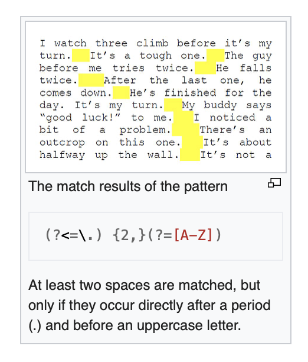

# Неделя 2, День 3 {#d3}

```{r}
library(data.table)
```


## Введение в работу с текстом {#text}

Работа с текстом - это отдельная и сложная задача. И у R все необходимые инструменты для этого!

Всю работу со строками (и текстом в целом) можно условно поделить на три уровня:

1) Базовые операции (до регулярных выражений)
2) Регулярные выражения
3) Natural language processing

Мы начнем с базовых операций. В R есть много функций для работы со строками. В принципе, их достаточно для того, чтобы делать весьма сложные вещи, но как это часто бывает с R, есть дополнительные пакеты, которые не только и не столько расширяют функционал, сколько делают нашу жизнь удобнее. 

Основных таких пакета два: `stringi` и `stringr`.  Давайте сразу их установим:

```{r, eval = FALSE}
install.packages("stringi")
install.packages("stringr")
```

```{r}
library(stringi)
library(stringr)
```

`stringi` - это базовый пакет, который имеет очень широкий функционал. Функции из этого пакета начинаются на `stri_`. `stringr` - это пакет, который является "оберткой" пакета `stringi`. Функции пакета `stringr` начинаются на `str_`. `stringr` - более "минималистичный": в нем меньше функций, чем в `stringi`. А еще `stringr` - это часть `tidyverse`, но этот пакет вполне можно использовать и без `tidyverse`, например, работая в `data.table`.

Тем не менее, для более-менее продвинутой работы с текстом придется выучить специальный язык - “регулярные выражения” (regular expressions или просто regex). Регулярные выражения реализованы на многих языках, в том числе в R. Но мы пока обойдемся наиболее простыми функциями, которые покроют большую часть того, что нам нужно уметь делать при работе с текстом.

Ну а после освоения базовых возможностей и регулярных выражений можно кидаться в естественную обработку языка и делать всякие топик моделлинги и прочие сентимент анализы. Впрочем, можно туда запрыгивать сразу, но обладая базовым инструментарием работы со строковыми данными, все эти штуки делать будет гораздо проще и эффективнее. Итак, поехали.

## Базовые операции с текстом {#text_base}

Строковые данные (`character`) - один из базовых типов данных в R. 

Для того, чтобы создать строковую переменную нужно использовать кавычки. Можно одинарные:

```{r}
'Всем привет!'
```

Можно двойные:

```{r}
"Всем привет!"
```

Разницы никакой! Главное использовать один вид кавычек для одного значения вектора. И еще: если использовать один вид кавычек для задания значения переменной, то другой вид кавычек можно использовать "внутри":

```{r}
"Всем 'привет'!"
```

```{r}
'Всем "привет"!'
```

Пустую строку можно сделать с помощью функции `character()`:

```{r}
character(1)
```

А вот это уже похоже на пассивную агрессию:

```{r}
"С тобой все в порядке?"
character(5)
```

Конечно, можно превращать другие типы данных в строки:

```{r}
as.character(1:10)
```

```{r}
as.character(TRUE)
```

### Объединение и разъединение строк {#text_c}

Как объединить строки? Очевидным способом будет попробовать функцию `c()`:

```{r}
c("Всем", "Привет")
```

И вроде бы это то, что нужно, но если посмотрите внимательно, то увидите, что оба слова выделены в кавычки. Короче говоря, мы просто соединили два значения в вектор (ну или два вектора длиной один в вектор длиной два).

Для того, чтобы соединить строковые значения, есть функция `paste()`:

```{r}
paste("Всем", "Привет")
```

Вот это то, что нужно!

У функции `paste()` есть параметр `sep = ` - разделитель, который по умолчанию является пробелом - `sep = " "`, но его можно поменять на любой другой, например:

```{r}
paste("Всем", "Привет", sep = "хэй!")
```

Обычно, правда, нам не нужно придумывать такие ухищренные разделители, а нужно, чтобы его вообще не было:

```{r}
paste("Всем", "Привет", sep = "")
```

Есть функция `paste0()`, которая является оберткой над обычным `paste()`, но уже с `sep = ""` по умолчанию:

```{r}
paste0("Всем", "Привет")
```

Теперь попробуем создать простой `data.table` с буквами. Буквы латиницы зашиты в R как константы:

```{r}
let <- data.table(small = letters[1:10], big = LETTERS[1:10])
let
```

Давайте теперь попробуем создать колонку `both`, где объединим обе колонки с помощью какого-нибудь разделителя:

```{r}
let[, both := paste(small, big, sep = "_")]
let
```

Ага! Если немного присмотреться, то можно заметить, что функция `paste()` "склеивает" несколько векторов и выдает на выходе вектор такой же длины. А вот чтобы соединить значения одного вектора в одно значение, нужно воспользоваться параметром `collapse = `:

```{r}
let[, paste(small, big, sep = "+", collapse = " -> ")]
```

Есть и более продвинутый способ соединения строк, который происходит еще из *C* и очень популярен в *Python*. Для этого способа есть функция `sprintf()`. Вот пример того, как она работает:

```{r}
sprintf("Добро пожаловать в %s, на дворе %i год", "СИРИУС", year(Sys.Date()))
```

Это может быть удобно, если Вы хотите в большую строчку вставить какую-то информацию из переменных.

Ну и наконец, самый продвинутый способ соединять строчки - это пакет `glue`. О да, для того, чтобы делать простые вещи очень просто нужно осваивать целый пакет! Но не беспокойтесь, у этого пакета очень интуитивно понятный синтаксис, который удобнее (на мой взгляд), чем `sprintf()`:

```{r, eval = FALSE}
install.packages("glue")
```

```{r}
library(glue)
let[, glue("{1:.N} буква латинского алфавита: {let$big}(заглавная) - {let$small}(строчная)")]
```

Теперь осталось научиться разъединять строковые значения. Для этого в пакете `data.table` есть функция `tstrsplit()` 

```{r}
let[, tstrsplit(both, "_")]
```

### Подсчет длины строк {#text_len}

Чтобы посчитать количество знаков, можно воспользоваться функцией `nchar()`:

```{r}
nchar(c("Всем", "привет"))
```

В качестве самостоятельного задания загрузите датасет со всеми текстами песен Дэвида Боуи, взятых с сайта [Genius.com](Genius.com):

```{r}
b <- fread("data/bowie2.csv")
b
```


Текст песен находится в колонке `lyrics`.

```{r}
b[, n_letters := nchar(lyrics)]
b[which.max(n_letters),]
```

Это какой-то речетатив Боуи, который еще и очень непросто найти.

Какова средняя длина песен Боуи?

```{r}
b[, mean(n_letters)]
```

### Выделение подстрок и обрезание строк {#text_cut}

Еще одна полезная функция - `substr()`, она позволяет "вырезать" из `character` кусок от "сих" (`start = `) и до "сих" (`stop = `)

Выглядит это так:

```{r}
substr("Не режь меня!", 4, 7) #вырезаем от 4 знака до 7
```

Более продвинутый способ "обрезать" значения есть в пакете `stringr`:

```{r}
b[, song_name_trunc := str_trunc(song_name, width = 15)]
head(b[, song_name_trunc], 10)
```

В аргументе `width = ` вы ставите максимально допустимую длину значения в векторе. Если значение длиннее, то конец отрезается, а вместо него присобачивается то, что задано в параметре `ellipsis = ` (по умолчанию там стоит многоточие). Отрезается ровно столько, сколько нужно, чтобы начало и `ellipsis = ` вместе были не больше чем `width = `. Эта функция очень удобна при создании графиков: очень неприятно, когда все не помещается из-за одного очень длинного названия.


Функция `str_pad()` позволяет добавить нужное количество пробелов (или других знаков):

```{r}
b[, song_name_pad := str_pad(song_name, 20)]
head(b[, song_name_pad], 10)
```

Функция `str_trim()` выполняет обратную задачу - удаляет лишние пробелы слева и/или справа:

```{r}
b[, song_name_trimmed := str_trim(song_name_pad)]
```

Функция `str_squish()` делает еще круче: она еще и удаляет повторяющиеся пробелы внутри.

```{r}
str_squish(" Привет,   всем")
```


### Изменение регистра {#text_to}

Чтобы перевести маленькие буквы в большие, нужно воспользоваться функцией `toupper()`:

```{r}
toupper("В чащах юга жил бы цитрус? Да, но фальшивый экземпляръ!")
```

```{r}
tolower("Съешь ещё этих мягких французских булок, да выпей же чаю")
```

Ну а чтобы сделать первую букву каждого слова заглавной - `str_to_title()`:

```{r}
str_to_title("Съешь ещё этих мягких французских булок, да выпей же чаю")
```

### Случайные последовательности {#text_rand}

Можно сделать случайные последовательности символов с помощью `stri_rand_strings()`
```{r}
set.seed(42)
stri_rand_strings(n = 5, length = 5:9)
```

Можно задавать символы, допустимые для генерации таких "псевдослов" с помощью параметра `pattern = `. 
Например, если хотим использовать только строчные буквы латиницы, нужно использовать паттерн `"[a-z]"`. Так паттерны задаются в регулярных выражениях, к которым мы вернемся позже.

```{r}
stri_rand_strings(n = 5, length = 5:9, pattern = "[a-z]")
```

> Строго говоря, это не то, что принято называть "псевдословами". Под псевдословами подразумеваются такие последовательности, которые звучат как настоящие слова, но не имеют смысла. Например, "ошмаска" или "утурник"

Ну а функция `stri_rand_shuffle()` принимает на вход строчку и возвращает ее же, но уже с перемешанными знаками.

```{r}
stri_rand_shuffle("съешь ещё этих мягких французских булок, да выпей же чаю")
```


### Сортировка {#text_sort}

Чтобы сортировать слова в алфавитном порядке, можно воспользоваться generic функцией `sort()`:

```{r}
sort(unlist(tstrsplit("съешь ещё этих мягких французских булок, да выпей же чаю", split = " ")))
```

> *generic* функция в R - это функция, которая по-разному работает для разных объектов (использует соответствующий данному классу метод). Когда функция получает объект, она первым делом смотрит, что это за класс, а потом действует исходя из класса объекта. Например, функции `print()`, `summary()` и `plot()` - они работают почти на любых объектах, по-разному реагируя на объекты разных классов. Поэтому столкнувшись с объектом неизвестного класса в R, попробуйте применить эти функции.

__Самостоятельное задание:__

1. Создайте `data.table` `mon` следующего вида:

```{r, echo=FALSE}
mon <- data.table(n = 1:12, Month = month.name)
mon
```

> Названия месяцов - это еще одна константа, зашитая в R! Она называется `month.name`.

2. Создайте колонку `info` следующего вида: "January is the 1 month" ... "December is the 12 month"


```{r, echo = FALSE}
mon[, paste(Month, "is the", n, "month")]
```


2. Сократите длину каждого месяца так, чтобы она была не больше 6 символов:

```{r, echo = FALSE}
mon[, str_trunc(Month, 6)]
```


3. Создайте в `mon` колонку `month`, где каждый месяц будет записан с маленькой буквы.

```{r, echo = FALSE}
mon[, month := tolower(Month)]
mon
```

4. Создайте колонку `month_anagram`, в котором будут анаграммы названия каждого месяца (т.е. в данном случае - перемешанные) из колонки `month`.


```{r}
set.seed(42) #запустите, чтобы у нас одинаковые рандомизации получились
```

```{r, echo = FALSE}
mon[, month_anagram := stri_rand_shuffle(month)]
mon
```

5. (*) Ну а теперь сложное задание - создайте функцию `is_anagram()`, которая проверяет, что два слова являются анаграммами.

>Подсказка: если в `tstrsplit()` использовать `split = ""`, то это разделит строку пол отдельным знакам.

```{r, echo = FALSE}
is_anagram <- function(a, b) paste(sort(unlist(tstrsplit(a, ""))), collapse = "") == paste(sort(unlist(tstrsplit(b, ""))), collapse = "")
```

```{r}
is_anagram("спаниель", "апельсин")
is_anagram("скол", "клок")
```

6. (*) Затем эту функцию нужно применить на колонки `month` и `month_anagram`. Скорее всего, придется либо векторизовать функцию, либо применить `mapply()`.

```{r}
mon[, mapply(is_anagram,month, month_anagram)]
```

## Поиск паттернов и регулярные выражения {#regexp}

Очень большая часть работы с текстом - это поиск паттернов. В самом простом случае - простых последовательностей.

### grep(), gsub() {#grep}

Для этого в R есть очень много функций. Пожалуй, самая распространенная из них -  функция `grep()`. Она выдает индексы значений вектора, в которых находится подходящая подстрока:

```{r}
mon[, grep("ber", month)]
mon[ grep("ber", month),] #Следите за запятой!
```

Можно возвращать и сами значения с помощью параметра  `value = TRUE`:

```{r}
mon[, grep("ber", month, value = TRUE)]
```

```{r}
mon[, grep("ber", month, value = TRUE, invert = TRUE)] #все остальные
```

Ну а функция `gsub()` заменяет найденный паттерн на новый. Давайте сделаем год более веселым:

```{r}
mon[, month_fun := gsub("ber", "berfest", month)]
```


Заметьте, первым параметром функции `grep()` идет `pattern = `, а не данные (вектор). Это довольно нетипичное поведение для R. Это "заимствованное" слово для R - изначально  `grep()` появилась в UNIX очень давно и означала _«search **g**lobally for lines matching the **r**egular **e**xpression, and **p**rint them»_. Вот и настала пора поразбираться с регулярными выражениями.

> Функции `grep()` и `gsub()` могут использовать "избегая" регулярных выражений, для этого нужно задать параметр `fixed = TRUE`. Я очень рекомендую это делать, если Вы еще не освоились с регулярными выражениями, иначе результат этих функций будет казаться непредсказуемым. 

### Регулярные выражения {#reg}

Регулярные выражения - это целый язык, который позволяет найти любой сложный паттерн в тексте. В основе всей сложной работы с текстом обычно лежат "регулярки". Поэтому стоит ознакомиться хотя бы с их основами.

> Регулярные выражения реализованы в очень многих языках программирования, не только в R, так что это довольно универсальный навык.



Учить их лучше всего интерактивно: очень удобно смотреть, что в тексте находится по введенному паттерну. В качестве примера я могу посоветовать ресурс [regexone](https://regexone.com). Потренироваться можно на [кроссворде](https://regexcrossword.com/challenges/beginner/puzzles/1). Пакет `stringr` тоже предоставляет удобный инструмент: функции `str_view()` (показывает первый найденный паттерн) и  `str_view_all()` (показывает все найденные паттерны). Первый аргумент в них - вектор с данными, второй - паттерн регулярных выражений. Если Все введено верно, то во вкладке Viewer окна RStudio появится данный вектор с выделенными паттернами.

Итак, перейдем к синтаксису "регулярок". Если нужно найти простую последовательность, то здесь все так же, как и обычно. Очень похоже на то, что Вы делаете, если нажимаете `Ctrl + F` и пытаетесь найти в тексте какое-то ключевое слово:

```{r}
names <- c("Саня", "Ваня", "Даня", "Женя", "Аня", "Андрей", "Леша", "Лера", "Витя", "Валера")
str_view_all(names, "аня")
```

Заметьте, "Аня" осталась за бортом, потому что регулярные выражения case-sensitive. Скажем, мы хотим найти паттерны "аня", написанные как с большой, так и с маленькой буквы. Здесь придут на помощь наборы - возможные варианты букв, которые мы ожидаем увидеть на нужном месте: 

```{r}
str_view_all(names, "[аА]ня")
```

Ура, мы поймали Аню!

Наборы можно задавать в целом диапазоне. Например, чтобы задать все буквы кириллицы, нужно задать такой диапазон: `[а-яА-ЯёЁ]` (`ё` и `Ë` находятся за пределами диапазонов `а-я` и `А-Я`).

```{r}
str_view_all(names, "[а-яА-ЯёЁ]ня")
```

Теперь мы поймали еще и Женю.

Символ `^` (внутри набора) означает, что мы ожидаем увидеть любые символы, кроме тех, что в наборе. Попробуйте догадаться, какие имена мы поймаем следующими паттернами: `"[^а-яА-ЯёЁ]ня"`, `"[^а]ня"`.

```{r}
str_view_all(names, "[^а-яА-ЯёЁ]ня")
```

```{r}
str_view_all(names, "[^а]ня")
```

Иногда нужно найти один из двух паттернов - то есть реализовать что-то вроде логического ИЛИ. В регулярных выражениях тоже такое есть. Более того, для этого нужен тот же оператор, что и в R - `|`. Например, мы хотим найти все имена, заканчивающиеся на "ня" и начинающиеся на "Ле":
```{r}
str_view_all(names, "Ле|ня")
```

Если бы паттерн включал бы в себя еще и варианты с маленькой буквы "л", то мы бы поймали еще и Валеру:

```{r}
str_view_all(names, "[лЛ]е|ня")
```

Чтобы этого избежать, мы можем задать, что `"[лЛ]е"` должно быть в начале строки (с помощью знака `"^"`), а `"ня"` - в конце.

```{r}
str_view_all(names, "^[лЛ]е|ня$")
```

Что если мы хотим найти точку? Давайте попробуем использовать ее в регулярном выражении:

```{r}
hello <- c("При 534вет.", "всем")
str_view_all(hello, ".")
```

Что-то не то. Дело в том, что точка (как и уже знакомые нам некоторые другие символы - `[]|^$`) - это спецсимволы, которые имеют специальную функцию в регулярных выражениях. Конкретно точка означает "любой знак". Но если нам нужно найти в тексте именно точку или другой спецсимвол, то его нужно _экранировать_ с помощью специального паттерна `\\` (вне R это `\`):

```{r}
str_view_all(hello, "\\.")
```

Для наиболее распространенных последовательностей есть специальные символы. С ними все наоборот, чтобы их использовать, нужно их экранировать. Например, `\\w` выдаст все цифробуквенные (*alphanumeric*) знаки:

```{r}
str_view_all(hello, "\\w")
```

А `\\W` - все кроме цифробуквенных знаков

```{r}
str_view_all(hello, "\\W")
```

`\\d` -  только цифры:

```{r}
str_view_all(hello, "\\d")
```

`\\D` -   кроме цифр:
```{r}
str_view_all(hello, "\\s")
```

`\\s` -  только  пробелы:

```{r}
str_view_all(hello, "\\S")
```

`\\S` -  все кроме пробелов:
```{r}
str_view_all(hello, "\\D")
```

Следующий этап наращивания нашей мощи инструментария регулярных выражений - количество паттернов.

В общем виде оно задается с помощью фигурных скобочек:

* `{n}`: ровно n
* `{n,}`: n или больше
* `{,m}`: не больше m
* `{n,m}`: между n и m

```{r}
long <- "1888 - самый длинный год, записанный в римских цифрах: MDCCCLXXXVIII"
str_view_all(long, "C{3}")
```

```{r}
str_view_all(long, "X{1,}")
```

```{r}
str_view_all(long, "н{1,2}")
```

Для самых распространенных вариантов количества искомых паттернов есть сокращения:

* `?` = 0 или 1
* `+` = 1 или больше
* `*` = 0 или больше

Например, чтобы вытащить все последовательности, начинающиеся на `Л` и заканчивающиеся на `а` (включая `Ла`), нужно записать так:

```{r}
str_view_all(names, "^Л.*а$")
```

Ну а что бы вытащить все последовательности, где стоит или не стоит какой-то символ, то записать нужно так:

```{r}
str_view_all(names, "^Ле.?а$")
```

__Самостоятельное задание:__

1. Найдите время в формате "04:30", "06:59" 

Проверьте на векторе `times`:

```{r}
times <- c("04:30", "06:59","fg:55","3345")
```

```{r, echo = FALSE}
str_view_all(times, "(2[0-3]|[0-1]\\d):[0-5]\\d")
```

2. Найдите время в формате "04:30", "06:59", игнорируя "невозможное" время, например, "19:84"

Проверьте на векторе `times`:

```{r}
times <- c("04:30", "06:59","fg:55","3345", "19:84")
```


```{r, echo = FALSE}
str_view_all(times, "2[0-3]|[0-1]\\d:[0-5]\\d")
```

3. Найдите время, которое может быть в других форматах: "4:20", "20-10", но не "20г21" или "2019"

Проверьте на векторе `times`:

```{r}
times <- c("04:30", "06:59","fg:55","3345", "19:84", "20-10", "4:20", "20r21", "2019")
```


```{r, echo = FALSE}
str_view_all(times, "(2[0-3]|[0-1]\\d)\\W[0-5]\\d")
```

## Анализ текста - что дальше? {#text_next}

Регулярные выражения - это супермощный инструмент. Однако он довольно непростой, да и выглядит совершенно монструозно. Хэдли Уикхэм приводит следующий пример реально используемого кода для поиска в тексте электронных почт:

```{r, eval = FALSE}
"(?:(?:\r\n)?[ \t])*(?:(?:(?:[^()<>@,;:\\".\[\] \000-\031]+(?:(?:(?:\r\n)?[ \t]
)+|\Z|(?=[\["()<>@,;:\\".\[\]]))|"(?:[^\"\r\\]|\\.|(?:(?:\r\n)?[ \t]))*"(?:(?:
\r\n)?[ \t])*)(?:\.(?:(?:\r\n)?[ \t])*(?:[^()<>@,;:\\".\[\] \000-\031]+(?:(?:(
?:\r\n)?[ \t])+|\Z|(?=[\["()<>@,;:\\".\[\]]))|"(?:[^\"\r\\]|\\.|(?:(?:\r\n)?[ 
\t]))*"(?:(?:\r\n)?[ \t])*))*@(?:(?:\r\n)?[ \t])*(?:[^()<>@,;:\\".\[\] \000-\0
31]+(?:(?:(?:\r\n)?[ \t])+|\Z|(?=[\["()<>@,;:\\".\[\]]))|\[([^\[\]\r\\]|\\.)*\
](?:(?:\r\n)?[ \t])*)(?:\.(?:(?:\r\n)?[ \t])*(?:[^()<>@,;:\\".\[\] \000-\031]+
(?:(?:(?:\r\n)?[ \t])+|\Z|(?=[\["()<>@,;:\\".\[\]]))|\[([^\[\]\r\\]|\\.)*\](?:
(?:\r\n)?[ \t])*))*|(?:[^()<>@,;:\\".\[\] \000-\031]+(?:(?:(?:\r\n)?[ \t])+|\Z
|(?=[\["()<>@,;:\\".\[\]]))|"(?:[^\"\r\\]|\\.|(?:(?:\r\n)?[ \t]))*"(?:(?:\r\n)
?[ \t])*)*\<(?:(?:\r\n)?[ \t])*(?:@(?:[^()<>@,;:\\".\[\] \000-\031]+(?:(?:(?:\
r\n)?[ \t])+|\Z|(?=[\["()<>@,;:\\".\[\]]))|\[([^\[\]\r\\]|\\.)*\](?:(?:\r\n)?[
 \t])*)(?:\.(?:(?:\r\n)?[ \t])*(?:[^()<>@,;:\\".\[\] \000-\031]+(?:(?:(?:\r\n)
?[ \t])+|\Z|(?=[\["()<>@,;:\\".\[\]]))|\[([^\[\]\r\\]|\\.)*\](?:(?:\r\n)?[ \t]
)*))*(?:,@(?:(?:\r\n)?[ \t])*(?:[^()<>@,;:\\".\[\] \000-\031]+(?:(?:(?:\r\n)?[
 \t])+|\Z|(?=[\["()<>@,;:\\".\[\]]))|\[([^\[\]\r\\]|\\.)*\](?:(?:\r\n)?[ \t])*
)(?:\.(?:(?:\r\n)?[ \t])*(?:[^()<>@,;:\\".\[\] \000-\031]+(?:(?:(?:\r\n)?[ \t]
)+|\Z|(?=[\["()<>@,;:\\".\[\]]))|\[([^\[\]\r\\]|\\.)*\](?:(?:\r\n)?[ \t])*))*)
*:(?:(?:\r\n)?[ \t])*)?(?:[^()<>@,;:\\".\[\] \000-\031]+(?:(?:(?:\r\n)?[ \t])+
|\Z|(?=[\["()<>@,;:\\".\[\]]))|"(?:[^\"\r\\]|\\.|(?:(?:\r\n)?[ \t]))*"(?:(?:\r
\n)?[ \t])*)(?:\.(?:(?:\r\n)?[ \t])*(?:[^()<>@,;:\\".\[\] \000-\031]+(?:(?:(?:
\r\n)?[ \t])+|\Z|(?=[\["()<>@,;:\\".\[\]]))|"(?:[^\"\r\\]|\\.|(?:(?:\r\n)?[ \t
]))*"(?:(?:\r\n)?[ \t])*))*@(?:(?:\r\n)?[ \t])*(?:[^()<>@,;:\\".\[\] \000-\031
]+(?:(?:(?:\r\n)?[ \t])+|\Z|(?=[\["()<>@,;:\\".\[\]]))|\[([^\[\]\r\\]|\\.)*\](
?:(?:\r\n)?[ \t])*)(?:\.(?:(?:\r\n)?[ \t])*(?:[^()<>@,;:\\".\[\] \000-\031]+(?
:(?:(?:\r\n)?[ \t])+|\Z|(?=[\["()<>@,;:\\".\[\]]))|\[([^\[\]\r\\]|\\.)*\](?:(?
:\r\n)?[ \t])*))*\>(?:(?:\r\n)?[ \t])*)|(?:[^()<>@,;:\\".\[\] \000-\031]+(?:(?
:(?:\r\n)?[ \t])+|\Z|(?=[\["()<>@,;:\\".\[\]]))|"(?:[^\"\r\\]|\\.|(?:(?:\r\n)?
[ \t]))*"(?:(?:\r\n)?[ \t])*)*:(?:(?:\r\n)?[ \t])*(?:(?:(?:[^()<>@,;:\\".\[\] 
\000-\031]+(?:(?:(?:\r\n)?[ \t])+|\Z|(?=[\["()<>@,;:\\".\[\]]))|"(?:[^\"\r\\]|
\\.|(?:(?:\r\n)?[ \t]))*"(?:(?:\r\n)?[ \t])*)(?:\.(?:(?:\r\n)?[ \t])*(?:[^()<>
@,;:\\".\[\] \000-\031]+(?:(?:(?:\r\n)?[ \t])+|\Z|(?=[\["()<>@,;:\\".\[\]]))|"
(?:[^\"\r\\]|\\.|(?:(?:\r\n)?[ \t]))*"(?:(?:\r\n)?[ \t])*))*@(?:(?:\r\n)?[ \t]
)*(?:[^()<>@,;:\\".\[\] \000-\031]+(?:(?:(?:\r\n)?[ \t])+|\Z|(?=[\["()<>@,;:\\
".\[\]]))|\[([^\[\]\r\\]|\\.)*\](?:(?:\r\n)?[ \t])*)(?:\.(?:(?:\r\n)?[ \t])*(?
:[^()<>@,;:\\".\[\] \000-\031]+(?:(?:(?:\r\n)?[ \t])+|\Z|(?=[\["()<>@,;:\\".\[
\]]))|\[([^\[\]\r\\]|\\.)*\](?:(?:\r\n)?[ \t])*))*|(?:[^()<>@,;:\\".\[\] \000-
\031]+(?:(?:(?:\r\n)?[ \t])+|\Z|(?=[\["()<>@,;:\\".\[\]]))|"(?:[^\"\r\\]|\\.|(
?:(?:\r\n)?[ \t]))*"(?:(?:\r\n)?[ \t])*)*\<(?:(?:\r\n)?[ \t])*(?:@(?:[^()<>@,;
:\\".\[\] \000-\031]+(?:(?:(?:\r\n)?[ \t])+|\Z|(?=[\["()<>@,;:\\".\[\]]))|\[([
^\[\]\r\\]|\\.)*\](?:(?:\r\n)?[ \t])*)(?:\.(?:(?:\r\n)?[ \t])*(?:[^()<>@,;:\\"
.\[\] \000-\031]+(?:(?:(?:\r\n)?[ \t])+|\Z|(?=[\["()<>@,;:\\".\[\]]))|\[([^\[\
]\r\\]|\\.)*\](?:(?:\r\n)?[ \t])*))*(?:,@(?:(?:\r\n)?[ \t])*(?:[^()<>@,;:\\".\
[\] \000-\031]+(?:(?:(?:\r\n)?[ \t])+|\Z|(?=[\["()<>@,;:\\".\[\]]))|\[([^\[\]\
r\\]|\\.)*\](?:(?:\r\n)?[ \t])*)(?:\.(?:(?:\r\n)?[ \t])*(?:[^()<>@,;:\\".\[\] 
\000-\031]+(?:(?:(?:\r\n)?[ \t])+|\Z|(?=[\["()<>@,;:\\".\[\]]))|\[([^\[\]\r\\]
|\\.)*\](?:(?:\r\n)?[ \t])*))*)*:(?:(?:\r\n)?[ \t])*)?(?:[^()<>@,;:\\".\[\] \0
00-\031]+(?:(?:(?:\r\n)?[ \t])+|\Z|(?=[\["()<>@,;:\\".\[\]]))|"(?:[^\"\r\\]|\\
.|(?:(?:\r\n)?[ \t]))*"(?:(?:\r\n)?[ \t])*)(?:\.(?:(?:\r\n)?[ \t])*(?:[^()<>@,
;:\\".\[\] \000-\031]+(?:(?:(?:\r\n)?[ \t])+|\Z|(?=[\["()<>@,;:\\".\[\]]))|"(?
:[^\"\r\\]|\\.|(?:(?:\r\n)?[ \t]))*"(?:(?:\r\n)?[ \t])*))*@(?:(?:\r\n)?[ \t])*
(?:[^()<>@,;:\\".\[\] \000-\031]+(?:(?:(?:\r\n)?[ \t])+|\Z|(?=[\["()<>@,;:\\".
\[\]]))|\[([^\[\]\r\\]|\\.)*\](?:(?:\r\n)?[ \t])*)(?:\.(?:(?:\r\n)?[ \t])*(?:[
^()<>@,;:\\".\[\] \000-\031]+(?:(?:(?:\r\n)?[ \t])+|\Z|(?=[\["()<>@,;:\\".\[\]
]))|\[([^\[\]\r\\]|\\.)*\](?:(?:\r\n)?[ \t])*))*\>(?:(?:\r\n)?[ \t])*)(?:,\s*(
?:(?:[^()<>@,;:\\".\[\] \000-\031]+(?:(?:(?:\r\n)?[ \t])+|\Z|(?=[\["()<>@,;:\\
".\[\]]))|"(?:[^\"\r\\]|\\.|(?:(?:\r\n)?[ \t]))*"(?:(?:\r\n)?[ \t])*)(?:\.(?:(
?:\r\n)?[ \t])*(?:[^()<>@,;:\\".\[\] \000-\031]+(?:(?:(?:\r\n)?[ \t])+|\Z|(?=[
\["()<>@,;:\\".\[\]]))|"(?:[^\"\r\\]|\\.|(?:(?:\r\n)?[ \t]))*"(?:(?:\r\n)?[ \t
])*))*@(?:(?:\r\n)?[ \t])*(?:[^()<>@,;:\\".\[\] \000-\031]+(?:(?:(?:\r\n)?[ \t
])+|\Z|(?=[\["()<>@,;:\\".\[\]]))|\[([^\[\]\r\\]|\\.)*\](?:(?:\r\n)?[ \t])*)(?
:\.(?:(?:\r\n)?[ \t])*(?:[^()<>@,;:\\".\[\] \000-\031]+(?:(?:(?:\r\n)?[ \t])+|
\Z|(?=[\["()<>@,;:\\".\[\]]))|\[([^\[\]\r\\]|\\.)*\](?:(?:\r\n)?[ \t])*))*|(?:
[^()<>@,;:\\".\[\] \000-\031]+(?:(?:(?:\r\n)?[ \t])+|\Z|(?=[\["()<>@,;:\\".\[\
]]))|"(?:[^\"\r\\]|\\.|(?:(?:\r\n)?[ \t]))*"(?:(?:\r\n)?[ \t])*)*\<(?:(?:\r\n)
?[ \t])*(?:@(?:[^()<>@,;:\\".\[\] \000-\031]+(?:(?:(?:\r\n)?[ \t])+|\Z|(?=[\["
()<>@,;:\\".\[\]]))|\[([^\[\]\r\\]|\\.)*\](?:(?:\r\n)?[ \t])*)(?:\.(?:(?:\r\n)
?[ \t])*(?:[^()<>@,;:\\".\[\] \000-\031]+(?:(?:(?:\r\n)?[ \t])+|\Z|(?=[\["()<>
@,;:\\".\[\]]))|\[([^\[\]\r\\]|\\.)*\](?:(?:\r\n)?[ \t])*))*(?:,@(?:(?:\r\n)?[
 \t])*(?:[^()<>@,;:\\".\[\] \000-\031]+(?:(?:(?:\r\n)?[ \t])+|\Z|(?=[\["()<>@,
;:\\".\[\]]))|\[([^\[\]\r\\]|\\.)*\](?:(?:\r\n)?[ \t])*)(?:\.(?:(?:\r\n)?[ \t]
)*(?:[^()<>@,;:\\".\[\] \000-\031]+(?:(?:(?:\r\n)?[ \t])+|\Z|(?=[\["()<>@,;:\\
".\[\]]))|\[([^\[\]\r\\]|\\.)*\](?:(?:\r\n)?[ \t])*))*)*:(?:(?:\r\n)?[ \t])*)?
(?:[^()<>@,;:\\".\[\] \000-\031]+(?:(?:(?:\r\n)?[ \t])+|\Z|(?=[\["()<>@,;:\\".
\[\]]))|"(?:[^\"\r\\]|\\.|(?:(?:\r\n)?[ \t]))*"(?:(?:\r\n)?[ \t])*)(?:\.(?:(?:
\r\n)?[ \t])*(?:[^()<>@,;:\\".\[\] \000-\031]+(?:(?:(?:\r\n)?[ \t])+|\Z|(?=[\[
"()<>@,;:\\".\[\]]))|"(?:[^\"\r\\]|\\.|(?:(?:\r\n)?[ \t]))*"(?:(?:\r\n)?[ \t])
*))*@(?:(?:\r\n)?[ \t])*(?:[^()<>@,;:\\".\[\] \000-\031]+(?:(?:(?:\r\n)?[ \t])
+|\Z|(?=[\["()<>@,;:\\".\[\]]))|\[([^\[\]\r\\]|\\.)*\](?:(?:\r\n)?[ \t])*)(?:\
.(?:(?:\r\n)?[ \t])*(?:[^()<>@,;:\\".\[\] \000-\031]+(?:(?:(?:\r\n)?[ \t])+|\Z
|(?=[\["()<>@,;:\\".\[\]]))|\[([^\[\]\r\\]|\\.)*\](?:(?:\r\n)?[ \t])*))*\>(?:(
?:\r\n)?[ \t])*))*)?;\s*)"
```

Обычно работа с текстовыми данными сводится к нескольким отдельным операциям. Например, нужно вытащить из HTML-файла все теги или наоборот избавиться от них. Для этого, конечно, есть специальные пакеты, например, `rvest`.
Еще иногда нужно делать _токенизацию_, то есть разбивать текст на токены - значимые единицы текста (обычно слова). Для этого есть пакет `tidytext`. Обычно затем нужно перевести эти слова в неопределенную форму (лемматизация) или отбросить окончания (стеммизация)  - см. пакет `SnowballC`. 

Есть удобные инструменты, которые умеют делать это все сразу. Например, пакет `udpipe`:

```{r, eval = FALSE}
install.packages("udpipe")
```

```{r}
library(udpipe)
```

Для примера возьмем одну песню Дэвида Боуи и "прогоним" через `udpipe::udpipe()`:

```{r}
heroes <- b[grep("Heroes",song_name)[1],lyrics]
tok_heroes <- udpipe(heroes, "english")
head(tok_heroes)
```

В результате мы получили очень длинный датафрейм, каждая строчка которого - это слово или знак препинания. Выглядит не очень симпатично (на первый взгляд), но с этим очень удобно работать. Например, с помощью функции `data.table::merge()` можно присоединить к словам сентимент-словарь и сделать сентимент анализ песен Дэвида Боуи. Можно посчитать частотность слов в его песнях. Или же исследовать их сочетание - и сделать топик моделлинг. Освоив базовый инструментарий работы с текстом, перед Вами открывается увлекательный мир анализа естественного языка!

## Fuzzy matching {#fuzzy}

Часто бывает, что два `character` значения совпадают не полностью. Например, в одном случае слово написано в единственном числе, а в другом - во множественном. Или того хуже - в одном случае слово написано с ошибкой. Такие ситуации особенно часто возникают при соединении несколько баз вместе или же когда данные вводятся вручную. Например, представим, что мы опросили людей, кто их любимый актер. Но вот незадача: некоторые написали имя любимого актера с ошибкой!

```{r}
actors <- c("Benedict Cumberbatch", "Bandersnatch Cummerbund", "Bendenswitch Cumbersquash", "Bennendim Cumbendatch", "Bendandsnap Cucumbersnatch", "Kevin Smith", "Emma Stone", "Martin Freeman")
```

В этой ситуации нам поможет fuzzy matching - примерное (approximate) сопоставление с паттерном. Как же измеряется эта "примерная похожесть"? О, как и всегда в таких случаях, за этим стоит целая наука. Самая распространенный способ посчитать похожесть, точнее, непохожесть - это расстояние Левенштайна. Это количество операций, которые нужно сделать, чтобы получить из одной строки другую. Вот список допустимых операций при расчете расстояния Левенштейна:

* вставка ab → aNb
* удаление aOb → ab
* замена символа aOb → aNb
* перестановка символов ab → ba

Для работы с расстояниями есть встроенная в R функция `agrepl()`. Однако она дает довольно ограниченные возможности, поэтому мы воспользуемся пакетом `stringdist`:

```{r, eval = FALSE}
install.packages("stringdist")
```

```{r}
library(stringdist)
```

Можно посчитать расстояние Левенштайна с помощью функции `stringdist()`, можно преобразовать расстояния в меры близости с помощью функции `stringsim()`:

```{r}
stringdist("Benedict Cumberbatch", actors)
stringsim("Benedict Cumberbatch", actors)
actors[stringsim("Benedict Cumberbatch", actors)>0.4]
```

__Самостоятельное задание:__

1. Найдите в скольки процентах песен Боуи использует слово "star" (в том числе и как часть слова).

```{r, echo = FALSE}
b[grep("star", lyrics), .N]/b[,.N]*100
```

Ого, как много!
2. А теперь найдите все упоминания "star", в том числе и как часть слова, в песнях Боуи. Посчитайте частоту встречаемости каждого из них.

```{r, echo = FALSE}
table(tolower(unlist(str_extract_all(b$lyrics, "\\w*star\\w*"))))
```


3. Найдите все варианты песни `"Space Oddity"` по данной версии с помощью fuzzy matching:

```{r}
space <- b[grep("Space Oddity", song_name)[1], lyrics]
```


```{r, echo = FALSE}
b[, sim := stringsim(space, lyrics)]
plot(b$sim)
b[sim>0.35,]
```

