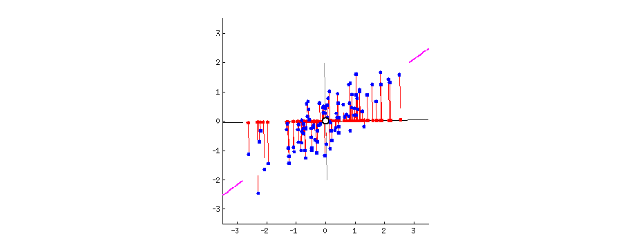

# Неделя 2, День 4 {#d4}

## Многомерные методы анализа данных {#multi}

Сегодняшнее занятие будет посвящено многомерным методам анализа данных - методам работы с данными, в которых много колонок. Мы уже сталкивались с некоторыми многомерными методами, такими как множественная линейная регрессия. Поэтому вы знаете, что многомерность создает новые проблемы. Например, при множественных корреляциях или попарных сравнениях возникает проблема множественных сравнений, а при использовании множественной регрессии лишние предикторы могут ловить только шум и приводить к переобучению (если говорить в терминах машинного обучения). Короче говоря, больше - не значит лучше. Нужно четко понимать, зачем мы используем данные и что пытаемся измерить.

Однако в некоторых случаях мы в принципе не можем ничего интересного сделать с маленьким набором переменных. Много ли мы можем измерить личностным тестом с одним единственным вопросом? Можем ли мы точно оценить уровень интеллекта по успешности выполнения одного единственного задания? Очевидно, что нет. Более того, даже концепция интеллекта в современном его представлении появилась во многом благодаря разработке многомерных методов анализа! Ну или наоборот: исследования интеллекта подстегнули развитие многомерных методов.

Наши данные как раз очень многомерные. Это данные опроса с использованием очень большого количества вопросов. Мы возьмем только колонки, содержащие в названии "Op" - это ответы на всякие мировоззренческие вопросы, а это значит, что на них нет правильного ответа, а разные люди будут отвечать по-разному. Эти вопросы связаны с отношением к науке и технологиям, к "научному мировоззрению". Например, "Scientific development is essential for improving people's lives" и "Consuming genetically modified (GMO) food is perfectly safe". Очевидно, что ответы на все эти вопросы будут как-то скоррелированы (положительно или отрицательно). С помощью таких методов как анализ главных компонент и факторный анализ можно уменьшить количество переменных и попытаться понять, что стоит на паттерном различий в ответах респондентов.


__Самостоятельное задание:__

1. Сделайте data.table opinion, в котором будут только колонки с `"OP"` или `"Op"` в названии.

```{r}
library(data.table)
data <- fread("data/iGLAS for R course.csv")
```

Для этого можно воспользоваться регулярными выражениями!

```{r}
op <- grep("iO[pP]", names(data), value = TRUE)
opinion <- data[, ..op]
```

2. Удалите все колонки, где слишком много `NA`, потом удалите строчки с `NA`:

Разобьем задачу на части: сначала создадим функцию, которая считает частоту `NA` в колонке: 

```{r}
frac_na <- function(x) mean(is.na(x))
```

Потом применим эту фунцкию, чтобы выделить названия колонок, в которых `NA` меньше половины: 

```{r}
not_na_op <- sapply(opinion, frac_na) < 0.5 
opinion <- opinion[, ..not_na_op]
```

Осталось удалить относительно небольшое количество строчек с NA:

```{r}
opinion <- opinion[complete.cases(opinion),]
```

3. Посчитайте матрицу корреляций opinion:

Напоминаю, что это можно сделать несколькими способами. Конечно, можно просто коррелировать каждую пару переменных с каждой:

```{r}
opinion[, cor.test(iOp01, iOp03)]
```

Из этих данных можно доставать значений корреляций - и так повторить для каждой пары переменных. Это не очень удобно. Можно сделать проще - с помощью функции `cor()` посчитать всю матрицу корреляций.

```{r}
opinion_cor <- cor(opinion)
opinion_cor
```

Ну а можно воспользоваться пакетом `"psych"`, который создаст специальный объект классов `"psych"` и `"corr.test"`. Внутри этого объекта будут и матрица корреляций и матрица p-values. 

```{r}
library(psych)
opinion_corr <- corr.test(opinion)
class(opinion_corr)
class(opinion_corr$r)
```

Если Вы решите проверить, совпадают ли результаты этих двух способов, то увидите, что, внезапно, нет:

```{r}
opinion_corr$r == opinion_cor
```

Причина в том, что дробные числа хранятся в компьютере как степени двойки с разной степенью точности - поэтому могут возникать такие вот небольшие различия. А вот если округлить, то все значения окажутся одинаковыми:

```{r}
round(opinion_corr$r,2) == round(opinion_cor,2)
```

Давайте отдельно посмотрим на матрицу p-values (в нижнем углу - сами p-values, в верхнем - с коррекцией на множество сравнений):

```{r}
round(opinion_corr$p, 3)
```

## Хитмап корреляций {#heatmap}

Как видите, почти все коррелирует друг с другом, даже с учетом поправок. Такие множественные корреляции лучше всего смотреть с помощью хитмап-визуализации:

```{r, eval = FALSE}
install.packages("corrplot")
```


```{r}
library(corrplot)
corrplot(opinion_cor, method = "color", order = "hclust")
```

Каждый квадратик - корреляция двух колонок. Синяя - положительная корреляция, красная - отрицательная. Чем насыщеннее цвет, тем сильнее корреляция (то есть выше значение по модулю). Колонки автоматически переставляются в нужном порядке для "группировки".

На картинке можно увидеть, что есть две основных группы вопросов, которые положительно коррелируют внутри группы друг с другом и отрицательно - с вопросами из другой группы.

Различиные многомерные методы анализа позволяют нам выйти за пределы анализа отдельных пар корреляций и попытаться понять структуру, которая стоит за этой корреляционной матрицей. Поэтому во многих многомерных методах анализа данных именно матрица корреляций выступает в роли входных данных.

## Анализ главных компонент (Principal component analysis) {#pca}

Анализ главных компонент (АГК) известен как метод "уменьшения размерности". Представьте, что вам дан набор данных с большим количеством количеством похожих переменных... Ох, надо же, наш датасет как раз именно такой! 

Действительно, подобная ситуация часто возникает в опросниковых данных. Для начала представим ответы на вопросы как точки в многомерном пространстве. Ну, многомерные пространтсва представлять сложно, но вот два измерения - вполне, получится стандартная диаграмма рассеяния.

Суть АГК в том, чтобы повернуть оси этого пространства так, чтобы первые оси объясняли как можно больший разброс данных, а последние - как можно меньший. Тогда мы могли бы отбросить последние оси и не очень-то многое потерять в данных.

Для двух осей это выглядит вот так:



Первая ось должна минимизировать красные расстояния. Вторая ось будет просто перпендикулярна первой оси.

> Математически, АГК - это нахождение собственных векторов и собственных значений матрицы корреляций или ковариаций. Собственные вектора - это такие особенные вектора матрицы, умножив которые на данную матрицу, можно получить тот же самый вектор (т.е. того же направления), но другой длины. А вот коэффициент множителя длины нового вектора - это собственное значение. В контексте АГК, собственные вектора - это новые оси (т.е. те самые новые компоненты), а собственные значения - это размер объясняемой дисперсии с помощью новых осей.

Итак, для начала нам нужно центрировать и нормировать данные - вычесть среднее и поделить на стандартное отклонение, т.е. посчитать z-оценки. Это нужно для того, чтобы сделать все шкалы равноценными. Это особенно важно делать когда разные шкалы используют несопоставимые единицы измерения. Скажем, одна колонка - это масса человека в килограммах, а другая - рост в метрах. Если применять АГК на этих данных, то ничего хорошего не выйдет: вклад роста будет слишком маленьким. А вот если мы сделаем z-преобразование, то приведем и вес, и рост к "общему знаменателю".

В нашем случае это не так критично, поскольку во всех случаях испытуемые отвечают по одинаковой 7-балльной шкале.

```{r}
opinion_scaled <- as.data.table(scale(opinion))
```

В базовом R уже есть инструменты для АГК `princomp()` и `prcomp()`, считают они немного по-разному. Возьмем более рекомендуемый вариант, `prcomp()`.

```{r}
prcomp(opinion_scaled)
```

В принципе, z-преобразование было делать необязательно, `prcomp()` умеет делать это сам:

```{r}
pr <- prcomp(opinion, scale. = TRUE)
pr
```

`summary()` выдаст полезную информацию, в частности, долю объясненной дисперсии и кумулятивную долю объясненной дисперсии

```{r}
summary(pr)
```

### Количество извлекаемых компонент {#pca_n}

Визуализация объясненных дисперсий с помощью каждого фактора может использоваться для того, чтобы решить, какие оси оставить, а какие отбросить.

```{r}
plot(pr)
```

Если после какой-то шкалы график резко "падает" и становится ровным, то можно предположить, что эти последние шкалы представляют некоторый "шум" в данных - их мы и собираемся отбросить.

В пакете `psych` есть функция `fa.parallel()`, которая позволяет не только визуализировать, но и дает пользователю количество рекомендуемых компонент. Важно понимать, что эти границы условны, поэтому не стоит безусловно доверять этой функции.

```{r}
psych::fa.parallel(opinion)
```

Можно визуализировать данные в новых осях (например, в первых двух):
```{r}
plot(pr$x[,1:2])
```

Наконец, выбрать желаемое количество компонент можно через параметр `rank. = `

```{r}
prcomp(opinion, scale. = TRUE, rank. = 4)
```

## Эксплораторный факторный анализ {#fa}

Чарльз Спирмен был один из пионеров использования коэффициентов корреляции в научных исследованиях. Он уже в самом начале XX века использовал корреляционные матрицы для исследования связи разных тестов, которые проходили школьники. Он обнаружил, что оценки по самым разным тестам коррелируют друг с другом. Короче говоря, если учащийся хорошо справляется с математикой, то и с музыкой у него, скорее всего, будет хорошо.

Чарльз Спирмен предположил, что за этими шкалами стоит некоторый единый фактор, который он назвал фактором *g* (от слова *general*) - общий интеллект. С точки зрения Спирмена, общий интеллект - это латентный фактор, который объясняет существующие корреляции между баллами за разные тесты, а то, что общий интеллект не объясняет, - это отдельные способности.

Для того, чтобы доказать свою теорию, Чарльз Спирмен придумал эксплораторный факторный анализ (ЭФА; *exploratory factor analysis*)[^1]. 

[^1]: Потом, правда, оказалось, что в данном случае факторный анализ ничего не доказывает, зато метод оказался очень полезным и получил большое распространение (особенно в психологии).

Суть ЭФА несколько сложнее АГК. Если в АГК мы просто вертим оси исходного пространства, чтобы максимизировать дисперсию первых осей и минимизировать дисперсию последних, то в ЭФА мы строим модель с заданным количеством латентных (т.е. "скрытых") переменных, которые должны объяснять общую дисперсию наблюдаемых переменных и быть ортогональными (перпендикулярными) друг другу. Ну а все необъясненное остается влиянием независимых индивидуальных факторов. Кроме того, полученные латентные факторы можно еще "повращать" для большей интерпретируемости латентных факторов. Причем "вращение" может быть как ортогональным (самое распространенное - варимакс) или косоугольным (например, облимин). В первом случае факторы останутся нескоррелированными, во втором случае - нет.

Для ЭФА есть много пакетов, более того, уже знакомый нам `psych` умеет делать ЭФА.

```{r}
fa_none_fit <- factanal(opinion_scaled, factors = 6, rotation = "varimax")
fa_none_fit
```

Получаемый результат имеет примерно тот же вид, что и при АГК. Нужно смотреть на кумулятивную объясненную дисперсию, а также смотреть на факторные нагрузки - связь латентных факторов с наблюдаемыми шкалами. Особенно нас интересуют факторные нагрузки близкие к 1 и -1 (значения близкие к нулю скрыты). Анализируя эти шкалы, можно сделать вывод о том, что из себя представляет латентный фактор содержательно. Возьмем для примера второй фактор. В нем есть как выраженные положительные, так и отрицательные нагрузки:

- __"Consuming genetically modified (GMO) food is perfectly safe"__ - положительная нагрузка _.569._

- __"When you are ill, how likely are you to turn to alternative medicine (such as homeopathy) rather than seeking treatment from conventional medicine?"__ - отрицательная нагрузка _-.575._

Можно предположить, что этот фактор означает доверие к академической науке: те, у кого высокое значение по этому фактору, не боятся ГМО, а те, у кого низкое значение, - верят в эффективность гомеопатии.

Давайте визуализируем с помощью `ggplot2` факторные нагрузки по первым двум факторам: 

```{r}
load <- fa_none_fit$loadings[,1:2]
library(ggplot2)
load_dt <- as.data.table(load)
load_dt$names <- rownames(load)
load
ggplot(load_dt, aes(x = Factor1, y = Factor2))+
  geom_point()+
  geom_text(aes(label = names), vjust = 1, hjust = 1)
```

## Конфирматорный факторный анализ {#cfa}

Как следует из названия, если ЭФА - это более эксплораторный метод анализа, то конфирматорный факторный анализ (КФА) предназначен для проверки моделей о структуре факторов. 

Как и в ЭФА, в КФА есть неизмеряемые латентные переменные, которые как-то объясняют измеряемые переменные. Однако если в ЭФА мы просто строим модель, где все латентные переменные объясняют все измеряемые переменные, то в КФА мы можем проверять более специфическую модель, где отдельные латентные переменные связаны только с определенными измеряемыми переменными. Кроме того, мы можем задавать (или не задавать) корреляции между латентными факторами и ошибками. 

Самый распространенный пакет для КФА в R - lavaan (LAtent VAriable ANalysis). Впрочем, это один из самых распространенных инструментов для КФА (и структурного моделирования, о чем будет позже) вообще!

Давайте сразу его установим и загрузим данные по 9 тестам младшеклассников. 

```{r, eval = FALSE}
install.packages("lavaan")
```


```{r}
library(lavaan)
data(HolzingerSwineford1939)
```

Модель предполагает, наличие трех коррелирующих друг с другом факторов: визуальный фактор (задания х1, х2, х3), текстовый фактор (задания х4, х5, х6) и фактор скорости (задания х7, х8, х9). Для того, чтобы задать такую модель, у `lavaan` есть свой синтаксис. Описание модели записывается в строковую переменную.

```{r}
HS_model <- "
visual =~ x1 + x2 + x3
textual =~ x4 + x5 + x6
speed =~ x7 + x8 + x9
"
```

Затем происходит фиттинг модели с помощью функции `cfa()`

```{r}
hs_cfa <- cfa(HS_model, data = HolzingerSwineford1939)
summary(hs_cfa)
```

Здесь мы можем увидеть, сошлась ли модель, оценки качества модели и оценки интересующих параметров модели.

Модели для КФА принято рисовать в виде блок-схем с кружочками, квадратиками и стрелочками. Есть несколько вариантов, как именно отрисовывать модели, например, нужно ли отдельным кружочком рисовать ошибку для каждой измеряемой модели. Но, в целом, правила такие: _круги_ - это латентные переменные, _квадраты_ - измеряемые переменные, _стрелочки_ - ассоциации между ними.

Для визуализации моделей, построенных в `lavaan`, существует пакет `semPlot`:

```{r, eval = FALSE}
install.packages("semPlot")
```

```{r}
library(semPlot)
semPaths(hs_cfa)
```

КФА лежит в основе структурного моделирования (*structural equation modelling, SEM*). По сути, структурное моделирование - это КФА + анализ пути (*path analysis*), который можно рассматривать как расширение множественной линейной регрессии - только вместо одного линейного уравнения у нас появляется целая система уровнений. Если же в системе уравнений использовать не наблюдаемые, а на латентные переменные, то получается структурное моделирование.

## Другие многомерные методы {#other_multi}

АГК, ЭФА, КФА, структурное моделирование - не единственные многомерные методы для анализа данных. За бортом осталось множество подходов, таких как кластерный анализ и многомерное шкалирование. В заключение я хочу показать еще один интересный подход к анализу данных в социальных науках - сетевой анализ, т.е. анализ графов. Этот метод активно применяется в исследованиях социальных сетей, в биологии и даже в гуманитарных науках.

В основе графа лежит матрица близости между переменными. В данном случае мы можем использовать уже знакомую нам матрицу корреляций. Тогда отдельная вершина будет отдельным пунктом опросником, а связью между ними - наличие корреляции выше выбранного порога (использовать пороговое значение необязательно, но сделает визуализацию нагляднее).

```{r, eval = FALSE}
install.packages("igraph")
```

```{r}
opinion_cor_abs <- abs(opinion_cor)
diag(opinion_cor_abs) <- 0
rownames(opinion_cor_abs) <- colnames(opinion_cor_abs) <- gsub("\\.", "", colnames(opinion_cor_abs))


library(igraph)
opinion_ig <- graph.adjacency(opinion_cor_abs, weighted = TRUE, mode = "lower")
opinion_ig <- delete.edges(opinion_ig, E(opinion_ig)[weight < 0.2])
plot(opinion_ig, vertex.colour = "grey", vertex.frame.color = NA,
     vertex.size = strength(opinion_ig)*3+2, vertex.label.dist = 1,
     edge.curved = 0, vertex.label.color = "black")
```

В R есть множество пакетов для интерактивных визуализаций графов.

```{r, eval = FALSE}
install.packages("edgebundleR")
```

```{r}
library(edgebundleR)
edgebundle(opinion_ig)
```

```{r, eval = FALSE}
install.packages("networkD3")
```

```{r}
library(networkD3)
opinion_nd3 <- igraph_to_networkD3(opinion_ig)
forceNetwork(Links = opinion_nd3$links, Nodes = opinion_nd3$nodes,
             Source = 'source', Target = 'target', 
             NodeID = 'name', Group = 1, opacity = 1)
```

